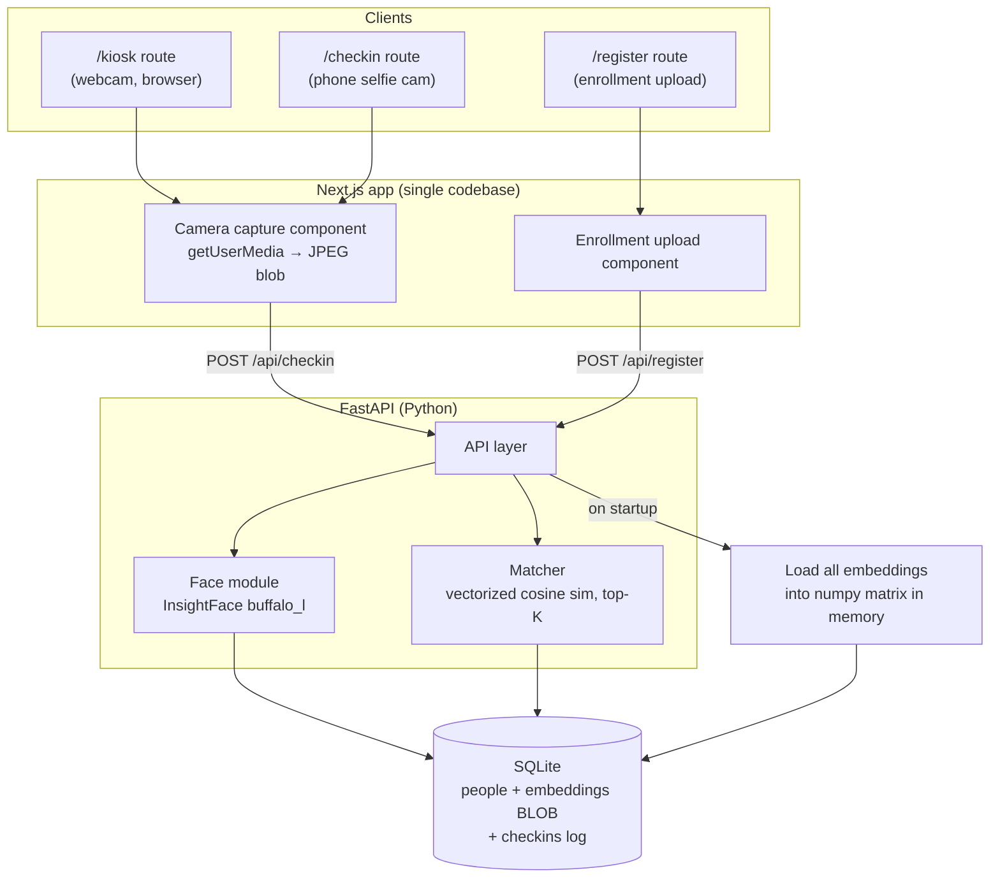

# Face-Recognition Check-In System — Build Spec

> **Purpose of this document:** A complete, self-contained specification an autonomous coding agent can follow to scaffold and build the whole system end-to-end. It states *what* to build, *why* each decision was made, the exact data contracts, and the order of operations. Where a decision could go wrong, the constraint is called out explicitly so the agent does not re-derive it badly.

---

## 0. Design decisions (read first — these shape everything)

These were settled before writing the spec. Do not silently override them.

| Decision | Choice | Why |
|---|---|---|
| **Threat model** | Honest, cooperative users. **No liveness / anti-spoofing.** | Nobody benefits from faking a check-in. Spoofing defense is the hardest part of such systems; removing it is the single biggest simplification. Do **not** add liveness checks. |
| **Identification UX** | **Rank-and-confirm, not auto-match.** Backend returns top-K candidates; the user taps the correct one. | At 500+ enrolled faces, blind 1:N auto-matching has a real false-match rate. A cooperative human confirming a top candidate collapses a hard identification problem into an easy "rank and confirm" one. |
| **Embedding model** | **InsightFace (ArcFace, `buffalo_l`)**, 512-dim, cosine similarity. | At 500+ people, dlib's 128-dim embeddings don't separate similar faces well enough. ArcFace separates much better. Bonus: installs from prebuilt `onnxruntime` wheels — **no dlib/CMake compilation pain**. |
| **Scale strategy** | Flat in-memory numpy matrix of all embeddings; vectorized cosine sim. **No FAISS / vector DB.** | 500–5,000 embeddings compare in well under a millisecond. A vector index is unjustified complexity at this scale. |
| **Front-ends** | **One Next.js app, two routes** (`/kiosk`, `/checkin`) sharing one backend. | Kiosk and phone differ only in the capture surface. Same encodings, same matching, same DB. Two capture UIs, one backend. |
| **Enrollment QC** | Validate every registration photo: exactly one detectable face, adequate size, frontal-ish. Reject otherwise. | One bad enrollment silently breaks matching for that person forever. Cheap to validate up front; saves "why won't it recognize me" support later. |

**Hard environment constraints the agent must respect:**
- `getUserMedia()` (browser camera) **requires HTTPS or `localhost`.** Plain HTTP over LAN will silently fail to grant camera access. Document this in the README and use HTTPS in any non-localhost deployment.
- InsightFace downloads its model pack (~300 MB) to `~/.insightface` on first run. Trigger this download during setup, not on the first user request.

---

## 1. Architecture



**Request flow, plainly:**
1. **Register:** client uploads a selfie → backend detects face, runs QC, computes 512-dim embedding → stores person + embedding BLOB in SQLite, and appends the embedding to the in-memory matrix.
2. **Check-in:** client captures a frame → backend computes the live embedding → cosine-sim against the in-memory matrix → returns top-K candidates (name + photo + score).
3. **Confirm:** client shows candidates; user taps the right one → backend logs a check-in row with timestamp.

---

## 2. Tech stack

| Layer | Choice | Notes |
|---|---|---|
| Backend | **FastAPI** + Uvicorn | Python is required anyway for InsightFace. |
| Face recognition | **insightface** + **onnxruntime** (CPU) | Use `onnxruntime-gpu` only if a CUDA GPU is present. |
| Image handling | **opencv-python-headless**, **numpy**, **Pillow** | headless avoids pulling GUI deps on a server. |
| DB | **SQLite** (`sqlite3` stdlib, or SQLModel/SQLAlchemy) | Embeddings stored as `BLOB` (numpy `float32` bytes). |
| Frontend | **Next.js** (App Router) + **TypeScript** | Single app, routes `/register`, `/kiosk`, `/checkin`. |
| Camera | `navigator.mediaDevices.getUserMedia` | Capture to `<canvas>` → JPEG blob. |

Pin a known-good Python toolchain. Suggested: Python 3.11, `insightface==0.7.3`, `onnxruntime` latest stable, `numpy<2.0` if any binary-compat issues surface with onnxruntime.

---

## 3. Project layout

```
face-checkin/
├── backend/
│   ├── main.py              # FastAPI app, routes, startup embedding load
│   ├── face.py              # InsightFace wrapper: detect, QC, embed
│   ├── matcher.py           # in-memory matrix + cosine top-K
│   ├── db.py                # SQLite schema + queries
│   ├── models.py            # pydantic request/response models
│   ├── config.py            # thresholds, paths, top-K
│   ├── requirements.txt
│   └── data/
│       ├── checkin.db       # created on first run
│       └── photos/          # stored registration JPEGs (see §6 privacy note)
└── frontend/
    ├── app/
    │   ├── register/page.tsx
    │   ├── kiosk/page.tsx
    │   ├── checkin/page.tsx
    │   └── components/CameraCapture.tsx
    ├── lib/api.ts
    └── package.json
```

---

## 4. Data model (SQLite)

```sql
CREATE TABLE IF NOT EXISTS people (
    id           INTEGER PRIMARY KEY AUTOINCREMENT,
    name         TEXT    NOT NULL,
    email        TEXT,
    details      TEXT,                       -- JSON blob for arbitrary metadata
    embedding    BLOB    NOT NULL,           -- 512 float32 = 2048 bytes, L2-normalized
    photo_path   TEXT,                       -- optional; see privacy note
    created_at   TEXT    NOT NULL DEFAULT (datetime('now'))
);

CREATE TABLE IF NOT EXISTS checkins (
    id           INTEGER PRIMARY KEY AUTOINCREMENT,
    person_id    INTEGER NOT NULL REFERENCES people(id),
    score        REAL    NOT NULL,           -- cosine similarity at match time
    checked_in_at TEXT   NOT NULL DEFAULT (datetime('now'))
);
```

**Embedding storage:** store the **L2-normalized** embedding as `np.float32(vec).tobytes()`. Reading back: `np.frombuffer(blob, dtype=np.float32)`. Storing it pre-normalized means cosine similarity is just a dot product at match time — no per-request normalization of stored vectors.

---

## 5. Backend specification

### 5.1 `face.py` — detection, QC, embedding

```python
import cv2
import numpy as np
from insightface.app import FaceAnalysis

# buffalo_l = SCRFD detector + ArcFace w600k recognition, 512-dim embeddings.
_app = FaceAnalysis(name="buffalo_l", providers=["CPUExecutionProvider"])
_app.prepare(ctx_id=0, det_size=(640, 640))

MIN_FACE_PX = 80          # reject faces smaller than this (too low-res to embed well)

class EnrollmentError(Exception):
    pass

def _decode(image_bytes: bytes) -> np.ndarray:
    arr = np.frombuffer(image_bytes, np.uint8)
    img = cv2.imdecode(arr, cv2.IMREAD_COLOR)   # BGR, as InsightFace expects
    if img is None:
        raise EnrollmentError("Could not decode image")
    return img

def embed_for_enrollment(image_bytes: bytes) -> np.ndarray:
    """Strict path: enforce QC. Returns L2-normalized 512-d float32 embedding."""
    img = _decode(image_bytes)
    faces = _app.get(img)
    if len(faces) == 0:
        raise EnrollmentError("No face detected. Use a clear, front-facing photo.")
    if len(faces) > 1:
        raise EnrollmentError("Multiple faces detected. Submit a solo photo.")
    f = faces[0]
    x1, y1, x2, y2 = f.bbox
    if min(x2 - x1, y2 - y1) < MIN_FACE_PX:
        raise EnrollmentError("Face too small/low-res. Move closer and retry.")
    return f.normed_embedding.astype(np.float32)   # already L2-normalized

def embed_for_checkin(image_bytes: bytes) -> np.ndarray | None:
    """Lenient path: pick the largest face, no rejection. None if no face."""
    img = _decode(image_bytes)
    faces = _app.get(img)
    if not faces:
        return None
    # Largest bbox = closest/primary subject (handles bystanders in frame).
    f = max(faces, key=lambda f: (f.bbox[2]-f.bbox[0])*(f.bbox[3]-f.bbox[1]))
    return f.normed_embedding.astype(np.float32)
```

Note the deliberate asymmetry: **enrollment is strict** (reject bad photos), **check-in is lenient** (pick the biggest face, never reject) — because at check-in the user is cooperative and waiting, and the confirm step catches errors anyway.

### 5.2 `matcher.py` — in-memory matrix + top-K

```python
import numpy as np

class Matcher:
    def __init__(self):
        self._ids: list[int] = []
        self._matrix: np.ndarray | None = None   # shape (N, 512), rows L2-normalized

    def load(self, rows: list[tuple[int, bytes]]):
        self._ids = [pid for pid, _ in rows]
        if rows:
            self._matrix = np.vstack(
                [np.frombuffer(b, dtype=np.float32) for _, b in rows]
            )
        else:
            self._matrix = np.empty((0, 512), dtype=np.float32)

    def add(self, person_id: int, embedding: np.ndarray):
        self._ids.append(person_id)
        emb = embedding.reshape(1, -1)
        self._matrix = emb if self._matrix is None or len(self._ids) == 1 \
            else np.vstack([self._matrix, emb])

    def top_k(self, query: np.ndarray, k: int = 3):
        """Return [(person_id, score)] sorted desc. Both sides L2-normalized,
        so cosine similarity == dot product."""
        if self._matrix is None or len(self._ids) == 0:
            return []
        sims = self._matrix @ query        # (N,) cosine similarities
        idx = np.argsort(-sims)[:k]
        return [(self._ids[i], float(sims[i])) for i in idx]
```

### 5.3 Thresholds (`config.py`)

```python
TOP_K = 3
# ArcFace cosine similarity. Same-person pairs typically score high; different
# people low. We are PERMISSIVE because a human confirms the result.
SIM_FLOOR = 0.30          # below this, don't even show as a candidate
SIM_STRONG = 0.50         # at/above this, highlight as the confident top pick
```

These are starting values for `buffalo_l`. **Calibrate on real enrolled data** before trusting them — capture a handful of true and false pairs and adjust. Never present them as fixed truth.

### 5.4 API endpoints (`main.py`)

| Method | Path | Body | Returns |
|---|---|---|---|
| `POST` | `/api/register` | multipart: `photo` (file), `name`, `email?`, `details?` | `{ id, name }` or `400 { error }` on QC failure |
| `POST` | `/api/checkin` | multipart: `frame` (JPEG file) | `{ candidates: [{ person_id, name, photo_url, score, confident }] }` |
| `POST` | `/api/confirm` | json: `{ person_id, score }` | `{ ok: true, checked_in_at }` |
| `GET` | `/api/checkins` | — | recent check-ins for an admin view |

On `/api/checkin`: if `embed_for_checkin` returns `None`, respond `{ candidates: [] }` so the client shows "no face detected — try again" and offers manual entry. **Always provide a manual-entry fallback path** — recognition will occasionally miss, and a stuck user with no fallback is the worst outcome.

**Startup:** in a FastAPI lifespan/startup handler, load all `(id, embedding)` rows into the `Matcher`. This is the in-memory matrix the design depends on.

---

## 6. Privacy & legal (do not skip — this is the real liability)

Biometric data is regulated independently of how it's stored. An embedding is still biometric data.
- **Store embeddings, not raw photos, by default.** Keep the registration JPEG only if there's a real need (e.g., showing a face thumbnail in the confirm UI). If kept, document why and for how long.
- Provide a **deletion path** (delete a person → remove DB row + photo + matrix entry).
- Surface **explicit consent** at registration ("you agree to face data being used for check-in").
- Depending on jurisdiction (e.g. Illinois BIPA, EU GDPR special-category data), written consent, a retention policy, and deletion-on-request may be legally required. The agent should add a `CONSENT.md` placeholder and a configurable retention window rather than hard-coding indefinite storage.

---

## 7. Frontend specification

### 7.1 `CameraCapture.tsx` (shared by `/kiosk` and `/checkin`)

Responsibilities:
- Request camera via `getUserMedia({ video: { facingMode } })` — `facingMode: "user"` for phone selfie / `"environment"` optional for kiosk.
- Render the stream in a `<video>`, draw a frame to an offscreen `<canvas>`, export `toBlob('image/jpeg', 0.9)`.
- POST the blob to `/api/checkin`, then render returned candidates as large tap targets (name + thumbnail + score). Tapping one calls `/api/confirm`.
- Show a clear "None of these / manual entry" button alongside candidates.

**Must handle:** permission denied, no camera found, and the HTTPS requirement (show an explicit message if `getUserMedia` is undefined, which happens on insecure origins).

### 7.2 Routes
- `/register` — file upload (or capture) + name/email form → `/api/register`; show QC errors inline.
- `/kiosk` — full-screen capture loop for a fixed webcam; large confirm buttons.
- `/checkin` — same component, phone-optimized layout, `facingMode: "user"`.

---

## 8. Setup — ordered steps for the agent

```bash
# ---- Backend ----
cd backend
python3.11 -m venv .venv && source .venv/bin/activate
pip install fastapi uvicorn[standard] python-multipart \
            insightface onnxruntime opencv-python-headless numpy pillow

# Trigger the one-time model download NOW (not on first request):
python -c "from insightface.app import FaceAnalysis; \
a=FaceAnalysis(name='buffalo_l'); a.prepare(ctx_id=0, det_size=(640,640)); \
print('model ready')"

# Initialize DB, then run:
uvicorn main:app --host 0.0.0.0 --port 8000

# ---- Frontend ----
cd ../frontend
npx create-next-app@latest . --typescript --app --no-tailwind  # or with tailwind
npm install
npm run dev    # localhost is a secure origin → camera works in dev

# ---- HTTPS for non-localhost ----
# Camera will NOT work over plain http://<lan-ip>. For LAN/kiosk testing use a
# self-signed cert or a tunnel (e.g. an HTTPS reverse proxy / dev tunnel).
```

**Verify install before building features:** the model-download command above is the canary. If it prints `model ready`, the hard part of the environment is done. onnxruntime ships prebuilt wheels, so unlike dlib there should be no compiler step — if pip tries to *build* something, stop and investigate rather than installing build tools blindly.

---

## 9. Acceptance criteria (definition of done)

1. `POST /api/register` with a clean solo photo creates a person and returns its id; with a no-face / multi-face / tiny-face photo it returns `400` with a human-readable error.
2. After registering ≥2 people, `POST /api/checkin` with one of their faces returns that person as the top candidate with the highest score.
3. `/kiosk` and `/checkin` both open the camera (on a secure origin), capture, and display tappable candidates.
4. Tapping a candidate writes a `checkins` row with a timestamp; the admin `/api/checkins` list reflects it.
5. A "none of these / manual" fallback exists and works when recognition misses.
6. Restarting the backend reloads all embeddings into memory (matching still works without re-registration).
7. Deleting a person removes their DB row, photo, and in-memory matrix entry.

---

## 10. Explicit non-goals (do not build these)

- ❌ Liveness / anti-spoofing detection (threat model is cooperative users).
- ❌ FAISS or any vector database (flat numpy is correct at this scale).
- ❌ Auto check-in without human confirmation (rank-and-confirm is the chosen UX).
- ❌ A separate native kiosk app (the `/kiosk` browser route is the kiosk).

---

## 11. Known sharp edges (carry these into the README)

- **HTTPS-or-localhost** for camera — the most common deployment surprise.
- **First-run model download** — do it in setup; never on the user's first request.
- **Embedding/version coupling** — all embeddings in the DB must come from the *same* model pack. If you ever change models, you must **re-enroll everyone**; embeddings are not comparable across models.
- **Lighting on the phone path** — users check in wherever they are; the confirm step is what absorbs the resulting noise. Do not tighten thresholds to compensate; that just causes more misses.
- **Demographic accuracy** — test recognition across your actual population's range of skin tones, ages, and genders before going live; report findings rather than assuming uniform accuracy.
